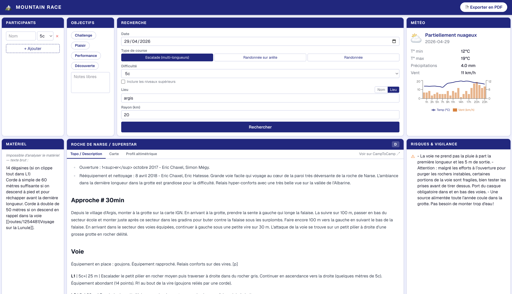

# Mountain Race

A single-page application to help plan mountain races with a group of friends. Enter your team, pick a route type and difficulty, search CampToCamp for matching routes, and get a full race plan — including weather, avalanche risk, schedule, equipment list, and a PDF export.


---

## Features

- **Route search** — searches [CampToCamp](https://www.camptocamp.org) by route name or geographic area (geocoded via OpenStreetMap Nominatim)
- **Natural-language search** — describe a race in plain French or English ("grande voie à Argis le 30/06") and the LLM extracts all search parameters automatically
- **Route detail** — topo/description, interactive map (real GPS from C2C), elevation profile, pitch-by-pitch breakdown for multi-pitch climbs
- **Weather & avalanche** — Open-Meteo forecast (MeteoFrance seamless model for ≤4 days, global model beyond) + MeteoFrance DPBRA avalanche bulletin with massif images
- **Schedule** — estimated duration from CampToCamp data or Naismith's rule fallback
- **Equipment list** — gear text from CampToCamp parsed into a structured list by an LLM
- **PDF export** — full race plan exported as landscape A4 via headless Chromium
- **Bilingual** — French and English, auto-detected from the browser

---

## Architecture

```
┌─────────────────────────────────────────────────┐
│  Docker Container (port 8003)                   │
│                                                 │
│  Gin (Go)                                       │
│  ├── /api/*          REST endpoints             │
│  └── /*              Static file serving        │
│                      (Next.js static export)    │
└─────────────────────────────────────────────────┘
```

| Layer | Technology |
|---|---|
| Frontend | Next.js · TypeScript · Tailwind CSS · next-intl |
| Backend | Go · Gin · chromedp |
| Maps | Leaflet / react-leaflet |
| Charts | Recharts |
| Geocoding | OpenStreetMap Nominatim (no key required) |
| Route data | CampToCamp anonymous read-only API |
| Weather | Open-Meteo (forecast) · MeteoFrance DPBRA (avalanche) |
| LLM | Gemini (default) · OpenAI · Ollama |

---

## Prerequisites

**To run with Docker** (recommended):
- Docker

**To run locally** (development):
- Go 1.26+
- Node.js 24+ and npm

Nothing is installed on the host machine when using the devcontainer — see [Devcontainer](#devcontainer).

---

## Quick Start

### 1. Configure environment variables

```bash
cp .env.example .env
```

Edit `.env` and fill in your credentials:

```
METEOFRANCE_USER=your_username
METEOFRANCE_PASS=your_password
GEMINI_API_KEY=your_gemini_key
```

> MeteoFrance credentials are required for the avalanche bulletin. Without them the avalanche panel shows mock data (risk level 2, no massif image).
> `GEMINI_API_KEY` is required for equipment extraction and natural-language intent parsing when `LLM_PROVIDER=gemini` (the default).

### 2. Build and run with Docker

```bash
make build   # builds the Docker image
make run     # runs on http://localhost:8003
```

Open [http://localhost:8003](http://localhost:8003).

---

## Development

### Local build (no Docker)

```bash
make local-build   # builds frontend, copies static files, compiles Go binary
make local-run     # starts the server on http://localhost:8003
```

`local-build` does three things in sequence:
1. `cd frontend && npm ci && npm run build` → produces `frontend/out/`
2. Copies `frontend/out/` → `backend/static/`
3. `cd backend && go build -o server .`

### Backend only (API development)

```bash
cd backend
go run .
```

The server starts on port 8003. Without a built frontend it returns a JSON status message for non-API routes.

### Frontend only (UI development)

```bash
cd frontend
npm install
npm run dev    # starts Next.js dev server on http://localhost:3000
```

> In dev mode, `/api/*` calls won't reach the Go backend. Run the backend separately or point to a running container.

### Running tests

```bash
# Backend unit tests
cd backend
go test ./...

# Verbose output
go test ./camptocamp/ -v
```

---

## Project Structure

```
mountain-race/
├── frontend/                   # Next.js TypeScript project (static export)
│   ├── src/
│   │   ├── app/                # Next.js App Router (single page)
│   │   ├── components/         # One component per panel (9 panels)
│   │   └── lib/                # Types, i18n helpers
│   └── messages/               # fr.json, en.json translation files
├── backend/                    # Go / Gin project
│   ├── main.go                 # Entry point: .env loading, router, static serving
│   ├── api/                    # HTTP handlers
│   ├── camptocamp/             # CampToCamp API client + unit tests
│   ├── llm/                    # LLM provider abstraction (Gemini/OpenAI/Ollama)
│   ├── meteo/                  # Open-Meteo forecast + MeteoFrance DPBRA avalanche
│   ├── schedule/               # Naismith's rule duration estimator
│   └── pdf/                    # Headless Chromium PDF export
├── data/                       # Fine-tuning dataset and notebooks for the gear LLM
├── planning/
│   └── plan.md                 # Build plan and implementation status
├── Makefile
├── Dockerfile                  # Multi-stage production build
├── Dockerfile.devcontainer     # Devcontainer for VS Code
├── docker-compose.yml
├── .env.example
└── README.md
```

---

## API Reference

All endpoints are prefixed with `/api`.

### `POST /api/routes/search`

Search CampToCamp for routes matching the criteria.

```json
{
  "location": "Chamonix",
  "location_type": "location",
  "race_type": "multipitch",
  "difficulty": "5c",
  "date": "2026-07-15",
  "participants": [
    { "name": "Alice", "climbing_level": "6a" }
  ]
}
```

- `location_type`: `"name"` searches by route name (C2C `q` param); `"location"` geocodes the text and searches by bounding box (20 km radius)
- `location`: free text, place name, or `"lat,lon"` (bypasses Nominatim for `"location"` type)
- `difficulty`: French sport grade (`5c`, `6a+`, …) for `multipitch`; alpine cotation (`F`, `PD`, `AD`, `D`, `TD`, `ED`) for hikes

**Response `200`:**
```json
{
  "routes": [
    {
      "id": "985727",
      "title": "Voie du Peigne",
      "summary": "...",
      "difficulty": "5c",
      "elevation_gain": 650,
      "distance_km": 4.2,
      "source_url": "https://www.camptocamp.org/routes/985727"
    }
  ]
}
```

---

### `POST /api/intent/parse`

Parse a natural-language race description into structured search parameters. Used by the frontend search bar.

```json
{ "text": "grande voie à Argis le 30/06", "lang": "fr" }
```

**Response `200`:**
```json
{
  "intent": {
    "location": "Argis",
    "location_type": "location",
    "race_type": "multipitch",
    "date": "2026-06-30"
  },
  "missing": []
}
```

`missing` lists required fields the LLM could not determine (`location`, `location_type`, `race_type`, `date`). The frontend uses this to prompt the user for the missing values.

---

### `GET /api/routes/:id`

Full detail for a CampToCamp route.

**Response `200`:**
```json
{
  "id": "985727",
  "title": "Voie du Peigne",
  "description": "...",
  "difficulty": "5c",
  "elevation_gain": 650,
  "distance_km": 4.2,
  "lat": 45.92,
  "lon": 6.87,
  "pitches": [
    { "number": 1, "grade": "5b", "description": "Dalle initiale" }
  ],
  "topo_url": "https://media.camptocamp.org/...",
  "gpx_url": "",
  "equipment": [
    { "name": "Corde 60m", "quantity": 1, "notes": "obligatoire" }
  ],
  "risks": ["Chutes de pierres en début de journée"],
  "alternative_routes": [
    { "id": "234567", "title": "Arête des Cosmiques", "reason": "Itinéraire alternatif" }
  ],
  "schedule": {
    "estimated_duration_hours": 5.5,
    "recommended_start_time": "06:00",
    "recommended_end_time": "14:00",
    "source": "camptocamp"
  },
  "source_url": "https://www.camptocamp.org/routes/985727"
}
```

`schedule.source` is `"camptocamp"` when duration data exists on C2C, or `"formula"` when computed via Naismith's rule. The UI shows a notice in the formula case.

---

### `GET /api/weather?lat=45.9&lon=6.9&date=2026-07-15`

Weather forecast and avalanche risk for a location and date.

**Response `200`:**
```json
{
  "forecast": {
    "date": "2026-07-15",
    "temperature_min_c": 8.0,
    "temperature_max_c": 22.0,
    "precipitation_mm": 0.0,
    "wind_speed_kmh": 15.0,
    "hourly": [
      { "hour": 6, "temperature_c": 10.5, "wind_speed_kmh": 12.0 }
    ]
  },
  "avalanche": {
    "risk_level": 2,
    "risk_label": "Limité",
    "massif_id": 15,
    "massif_name": "Belledonne"
  }
}
```

For dates within 4 days: uses Open-Meteo with `models=meteofrance_seamless` and `temperature_100m`. Beyond 4 days: uses the global Open-Meteo API with `temperature_120m`. Avalanche data requires MeteoFrance credentials; falls back to `risk_level=2` (no `massif_id`) when unavailable.

---

### `GET /api/avalanche/image?massif_id=15&type=montagne-risques`

Proxy for MeteoFrance DPBRA massif images. Requires Bearer auth — the backend handles the token transparently.

`type` must be one of: `montagne-risques`, `apercu-meteo`, `sept-derniers-jours`.

---

### `POST /api/export/pdf`

Generate a PDF of the full race plan. Request body is the `GET /api/routes/:id` response shape plus a `weather` block. Returns `application/pdf` (landscape A4).

---

## Environment Variables

| Variable | Description | Required |
|---|---|---|
| `METEOFRANCE_USER` | MeteoFrance API username | For avalanche data |
| `METEOFRANCE_PASS` | MeteoFrance API password | For avalanche data |
| `LLM_PROVIDER` | LLM backend: `gemini` (default), `openai`, `ollama` | No |
| `GEMINI_API_KEY` | Gemini API key | When `LLM_PROVIDER=gemini` |
| `GEMINI_MODEL` | Gemini model name (default: `gemini-2.5-flash-lite`) | No |
| `OPENAI_API_KEY` | OpenAI API key | When `LLM_PROVIDER=openai` |
| `OPENAI_MODEL` | OpenAI model name (default: `gpt-4o-mini`) | No |
| `OLLAMA_URL` | Ollama base URL (default: `http://host.docker.internal:11434`) | When `LLM_PROVIDER=ollama` |
| `OLLAMA_MODEL` | Ollama model name (default: `llama3.2`) | No |
| `HF_TOKEN` | HuggingFace token for dataset push | For fine-tuning only |

`LLM_PROVIDER` controls both equipment extraction and natural-language intent parsing. The backend loads `.env` from the project root.

---

## LLM Integration

The `backend/llm/` package provides a single `Provider` interface used for two tasks:

- **Equipment extraction** — converts CampToCamp's free-form `gear` text into a structured JSON array (`name`, `quantity`, `notes`)
- **Intent parsing** — converts a natural-language race description into structured search parameters (`location`, `race_type`, `date`, etc.)

Provider is selected at runtime via `LLM_PROVIDER`. All prompts live in `backend/llm/prompts.go`.

### Fine-tuning a dedicated gear model

The `data/` folder contains everything to fine-tune a smaller model specifically for gear extraction:

1. Generate the dataset: `cd backend && go run ./cmd/generate_gear_dataset`
2. Clean and prepare: `data/gear_preparing.ipynb` (run locally)
3. Train: `data/gear_training.ipynb` (run on Google Colab with GPU)
4. Evaluate: `data/gear_testing.ipynb`
5. (Optional) Convert for Ollama local use:
   ```bash
   hf download yrichard/gear_training-2026-04-28_13.15.01-merged --local-dir ./data/gear_merged
   python ../llama.cpp/convert_hf_to_gguf.py ./gear_merged --outfile ./data/gear.gguf --outtype q8_0
   ollama create gear-assistant -f Modelfile
   ```


---

## Devcontainer

The project uses a VS Code devcontainer defined in `Dockerfile.devcontainer`. It provides Go, Node.js, and all required system libraries without installing anything on the host machine.

To use it: open the project in VS Code and select **Reopen in Container** when prompted.

> Docker is not available inside the devcontainer. Use `make local-build` + `make local-run` for development, or build/run from the host machine.

---

## Known Limitations

| Area | Status |
|---|---|
| **Elevation profile** | The chart shows a synthetic bell-curve based on elevation gain and distance. Real GPX track decoding is not yet implemented. |
| **Nominatim rate limit** | The geocoding endpoint is subject to Nominatim's public 1 req/s limit. Production use should add caching or a self-hosted instance. |
| **Intent parsing with small models** | `llama3.2` handles the main cases (location, race type, French dates) but is unreliable for participants and `location_type`. Gemini and OpenAI work correctly for all cases. |
| **Frontend unit tests** | React Testing Library tests are planned but not yet written. |
| **E2E tests** | Playwright test suite (`test/`) is planned but not yet implemented. |
